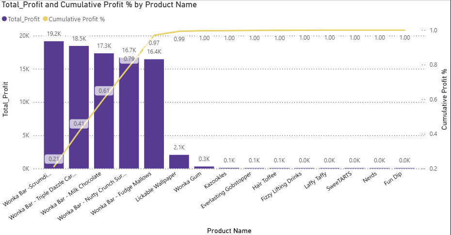
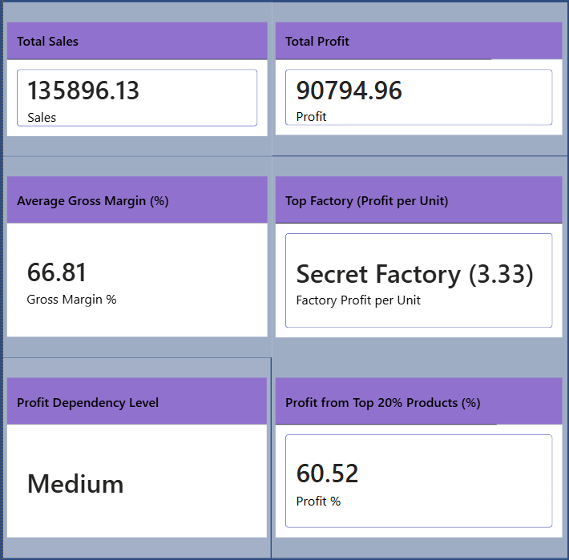
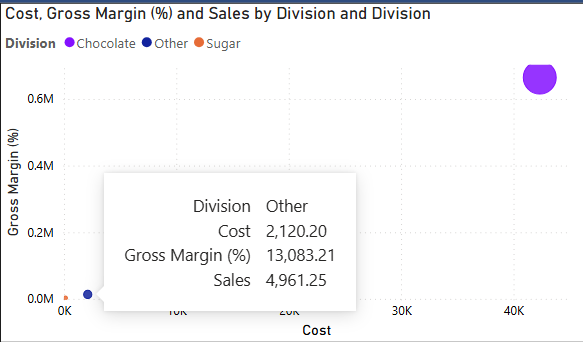
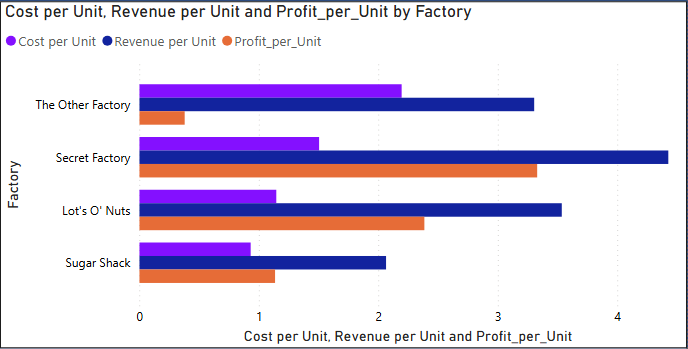

# Product Profitability & Dependency Risk Analysis
This project performs an end-to-end product profitability analysis using Python and Power BI to identify profit drivers, profit concentration (dependency risk), and operational inefficiencies, enabling data-driven executive decision-making.

# Business Problem

Many businesses generate the majority of profit from a small number of products, creating hidden profit dependency risk.
Without structured analysis, it becomes difficult to:

Identify true profit drivers

Detect margin dilution

Evaluate operational efficiency

Make strategic portfolio decisions

# Methodology

Data cleaning and preprocessing using Python

Outlier treatment using IQR-based capping

Feature engineering:

Total Profit

Margin %

Profit Contribution %

Cumulative Profit %

Pareto (80/20) analysis for dependency assessment

Cost vs margin diagnostics

Factory and division-level efficiency analysis

Export of Power BI–ready datasets

# Key Visuals & Analysis
# Profit Concentration (Pareto Analysis)
 

Shows cumulative profit %, highlighting dependency risk from top products.

# Executive KPI Strip

 

KPI overview including Total Sales, Total Profit, Avg Margin, and Dependency Level.

# Cost vs Margin Diagnostics
 

Identifies high-cost, low-margin products impacting profitability.

# Factory Efficiency Comparison
 

Compares operational performance across factories.

# Skills & Tools

Python: Pandas, NumPy, Seaborn, Matplotlib

Analytics: KPI design, Pareto analysis, outlier handling

BI: Power BI, DAX, executive dashboards

Business Skills: Insight generation, storytelling, decision support

# Results & Insights

Top products contribute over 90% of total profit

Business exhibits medium-to-high profit dependency risk

Several products dilute margins despite good sales

Factory-level efficiency varies significantly

# Business Recommendations

Focus on high-margin, high-profit products

Optimize or reconsider low-margin product lines

Reduce dependency risk through portfolio diversification

Improve efficiency in underperforming factories

Track KPIs continuously using executive dashboards

# Outcome

Delivered a business-ready analytics solution transforming raw data into actionable insights, suitable for Data Analyst / Business Analyst portfolios.

Tech Stack: Python | Power BI

Author: Dikshit
